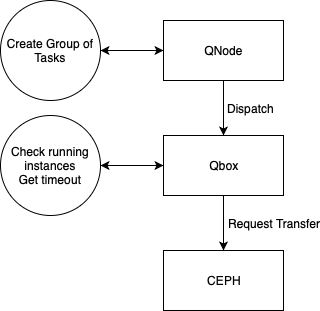
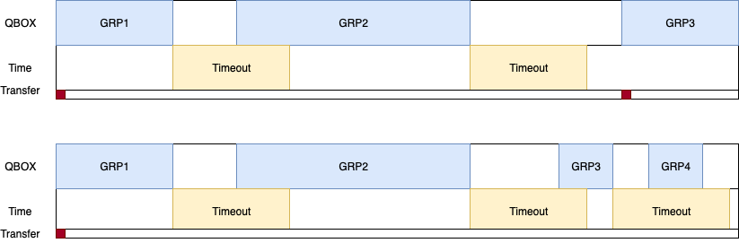

## Problems why we cannot simulate

### Issue with downsampling

The tables (except transfer_history) are downsampled after the data becomes older than 2 weeks. The 2 weeks retention policy is the only source of accurate data. When using the Qarnot extractor, queries even for a day take a very long time and it crashes. So simulations till now have been running on the 2 months retention policy and will have to use this downsampled data until the extractor does not crash on the 2 weeks retention policy.

The problem with this downsampled data is that we are not only loosing information, we are also possibly making the information biased. Eg: for a qmobo the downsample statement has ; last(qguid), mean(motherboard_cpu_temperature), mean(memory_usage), mean(cpu_scaling_frequency)
Here when the downsample occurs, the final entry effectively says that in the past unit time of resampling, the last qmobo had the mean temperature, memory usage, cpu_scaling_freq of the past unit time. This is making the data extrememly biased.

For the workload related data, all the entries are last(field). But given that the columns for many of them are empty, we still might end up with the wrong data. Using last(field) is a bad way to sample data. We loose the density and maybe we are just sampling the generic values.

This biased information is being fed to the simulator, Even with the static scheduer, this cannot work!

### Issue with Initial State

When the simulation occurs, the qboxes are empty initially, since the number of datasets is very high and are being used repeatedly for more than a month by multiple jobs, they are usually always present in the qbox. This behaviour cannot be exactly replicated in simulation. The effect of this can be minimized, but it is hard to say by how much.

### Issue of aggregation

In the current infra, several instances are dispactched at once on a given Qbox (which I am saying as aggregation). In such a case, only one transfer will occur and be reported. As long as there is an instance, and new instances arrive a transfer will not be triggered (it is assumed that the data is present as another instance of the task is already present which has requested the data before).

However, if for some reason the qbox stops being used by this task for a few minutes (the timeout_interval), and a new instance of the task then arrives on the qbox, a new transfer is triggered because the system forgot that the task had been there before. The new transfer may or may not pull new data, depending on whether the dataset was changed by the user, which is not under our control.

The state now is that the timeout is not implemented and the aggregation is still dynamic, but based on the same algorithm of Qarnot. It is a greedy approach to solve the bin packing problem (based on priority and number of instances per job). If the data is exactly correct, this shouldn't be a problem. But small errors might then snowball into large, unexpected differences as the number of instances in small amount of data is high.

One more issue that can occur is that the data can be lost during the timeout_interval. In such a case, no transfer_history entry will be added and still transfer might happen. But the probability of this happening is very very small.

### Issue with Simulating Speculation

The simulation assumes that the data is always present in the CEPH if required by any job. This condition is implemented as the CEPH loads all the data (that has ever come in the system) into the CEPH before the simulation starts. Speculation is when the user enters the system and then adds the data to the CEPH. This dynamic nature of CEPH is not implemented and hence cannot be simulated.

Speculation will be very hard to show any improvements in the current system. This is because the data popularity is very high and data is being used by a lot of jobs. Hence data is already required at a lot of qboxes.

### Other Issues

1. Batsim issue with high memory usage. 100GB of virtual memory for 2_weeks of simulation where the data is extracted from 2_months retention policy.
2. In this case, running the simulation for more than a month will be not possible.
3. Batsim is unable to handle UP transfers (which recently have been very high in number).
4. Also, most of the non-zero Down transfers are due to modifications. Batsim is currently not being implemented to handle datasets at a file level as this information is not available from Qarnot's side.s