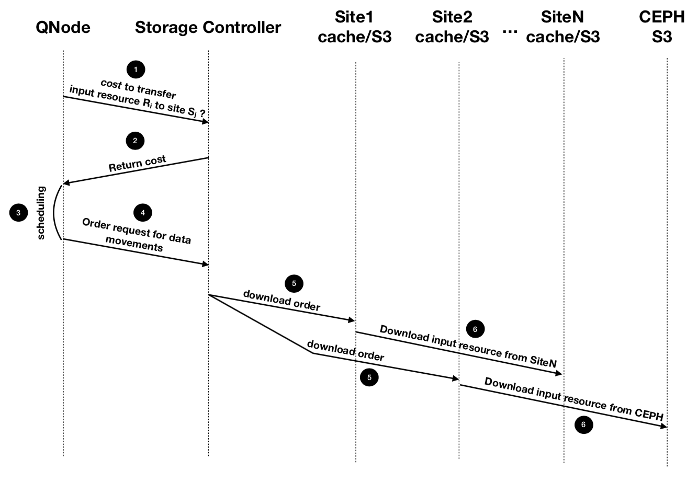

```
title : Project GRECO
author : Adwait Jitendra Bauskar
date : 1st March 2019
```

# Project GRECO

## Architecture

There are three componenets to the Qarnot computing architecture. These three components communicate with each other via a Wide Access Network.


### Public DC
This is a datacenter (provided by a third party) that acts as the main centre of the architecture. It performs scheduling, acts as an entry point for all the users, has storage where the users can upload their data, etc.
1. REST : This acts as an API gateway for the users that manages authentication, invoicing etc.
2. CEPH : This is a distributed storage present on the cloud that stores all the user data. User interacts with this storage directly to put in 'input resources' and get the processed 'output resources'. Transient, data is deleted when unecessary.
3. QNode : This is the scheduler that schedules which data goes to which QBox. This directly talks with the QBoxes which process the computation and then store it back to CEPH. It receives requests from the users and stores them
>The QNodes in the current implementation are oblivious to the data movements. 

The QNodes are not directly connected to a CEPH server. Input files go from REST to CEPH. REST is connected to atleast one QNode. This is not one single REST or CEPH or QNode. They are all deployed in multiple data centeres.

### QBox
These are the edge scheduling devices. Control multiple QRads.
1. Controller : Gathers information about the Qrads and controlls the data movements
2. Data Cache : An LRU Cache that talks directly with the CEPH Storage
3. NFS (Network File System) : Links to areas in cache so that QRads can access the data
4. QRad : These are computation units that are controlled by the parent QBox. They are the 'heaters' that interact with the physical world. The consists of multiple QMobos (Motherboards) that home the computation. These do not have storage inbuilt, they talk with the QBox for tasks and data.
> No QBox to QBox communication.
        
> QBoxes have restrictions on how far the QRads can be controlled. Usually they are at a building level. So for a large site, there might be multiple QBoxes at the same location.

> No idea on the size of the data that is going to be processed.
5. QMobos : Computing server with CPU, RAM, Network Controller and optionally a GPU and local storage. They are all booted over the network. 

- QNodes connect to multiple QBoxes. A QBox can have two QNodes. Can lead to state inconsistencies when deployed with the same task on the same QMobo.

## Processes in Qarnot

The Qarnot model consists of three types of tasks.
1. Resource manager : Managing the resources of the platform. Processed in the QBoxes, QNodes, CEPH and Rest.
2. Tasks related to cloud services : Maintaining and processing cloud services which are either used or hosted. Run of specific cloud servers.
3. Compute activites : These are the activities as required by the customer. Run on QMobos.

DCC (Distributed Cloud Computing) Computation tasks
1. General Cloud batch processing : Eg, running a docker image.
2. A specific Cloud Service : A specific cloud service that is provided. Similar to above.
3. Node reservation : IaaS (Distributed?).
4. Background tasks : Doing computation when idle. Eg. Cryptocurrency mining.

Smart Building Tasks
Relating to the compute required for the heating and other IOT related tasks that Qarnot provides.
1. Learning process : Generate and Train a ML model.
2. Decision process : Decide on the parameters of the platform.

## Execution Workflow


## Limitations

> NFS is not scalable. The number of QMobos will limit the performance.
- Propose a local S3 type datastore
  
 

> The scheduler in QNode is not aware of the data aspects of the system. If the QMobo is scheduled to execute a task, but the data is not yet arrived, this will cause blocking. Unsafe as it becomes feasible for a DDoS attack.

> QBoxes do not have API to push or pull data from other QBoxes. This limits the size of the job that can be processed. Jobs that communicate with each other are not possible.

> The necessity to upload to an external S3 storage before submitting tasks. Data has to go back and forth. Critical for IOT.

## Envisioned Architechture


- The DFS also acts as a gateway to expose data-sets available in the cache.
- Users can now directly upload data to local cache.
- Introduce the Storage Controller. This will make the scheduler aware of the data movements in the system.

### Storage Controller

The idea is to make sure that the scheduler knows about the data locations to prevent blocking of QMobos and also for better scheduling efficiency. Will maintain a global knowledge for the network and storage resources.
1. Current links + throughputs
2. The available storage spaces
3. Input resources in caches
4. Ongoing data transfers

Focus on integration between the scheduling policies and the data movements in a cloud of things infrastructure.

> The QBoxes cannot expose services due to lack of public IP, security concern not to open ports. In such a case, regional S3 instances can be used.

- [ ] I think it is better to have multiple S3 services as it will abstract out the storage part from the scheduling part. Synchronization at only the cloud tier and having data and scheduler mixed at QBox will lead to implementation issues. Rather than this, seperating the data delivery and scheduling part across the whole system will be much more easier and efficient.

### New Eecution Workflow



The proposed Storage controller will need to have three components
1. A knowledge base : This stores a map of the data in the system
2. Data Movement model : This predicts the cost of moving data
3. Data Movement operations : Operations that the controller does to move data as required.

The Movement model only depends on the knowledge base while the data operations depends on the knowledge base, the DC storage and also the edge networks.

The storage controller has to also keep looking for inconsistencies that occur at the node level. 


### Challenges

1. Accurately estimating the data transfer costs. Depends on size, available throughput, presence of caches, available storage space in each cache (keeping in mind the LRU swapping).

2. Keeping track of data movement operations that are locally triggered. For example a storage node failure needs to be updated and the scheduling operations need to be modified.

3. Using edge caches to trasmit data.

4. Speculation in data movements.
   1. Speculative allocation of new data.
   2. Speculative allocation of migration of data rather than deleting in case of cache overflow.

## An Outline for Cloud of Things

1. Decentralized architechture with offloading between centers .Idea is to have geo-distributed closters with their own software stack. These clusters can schedule jobs in themselves and are able to send and receive jobs from other clusters without the DC.
2. Blur the distinction between servers, sensors and other devices. Every device is unique and has its own unique set of abilities. Every device will be given by a profile which will show the computing, network, storage, sensing and interfacing capabilities. It will also include dynamic data like availability, occupance, energy (as some are possibly battery powered) and its own metrics.
3. The fog computing middleware. This is a common middleware that will talk with all devices from the edge network to the cloud.

### Issues with Cloud of Things

1. Given the profiles of each device, how to cluster them? How does this cluster scale or reconfigure?
2. Automate veritcal and horizontal offloading between clusters. This refers to the movement of jobs when the cluster is NA.
3. QoS, SLAs.
4. Scheduling and Data Management

### Computation tasks with CoT

1. Sequential : Singular task with input and output.
2. Pipeline : A chain of tasks where the output of the task are inputs for the next task in chain.
3. Bag : A group of similar tasks with no data dependencies between each other.
4. Graph : The most general way to define dependencies between tasks. All the above tasks are a specific version of this.